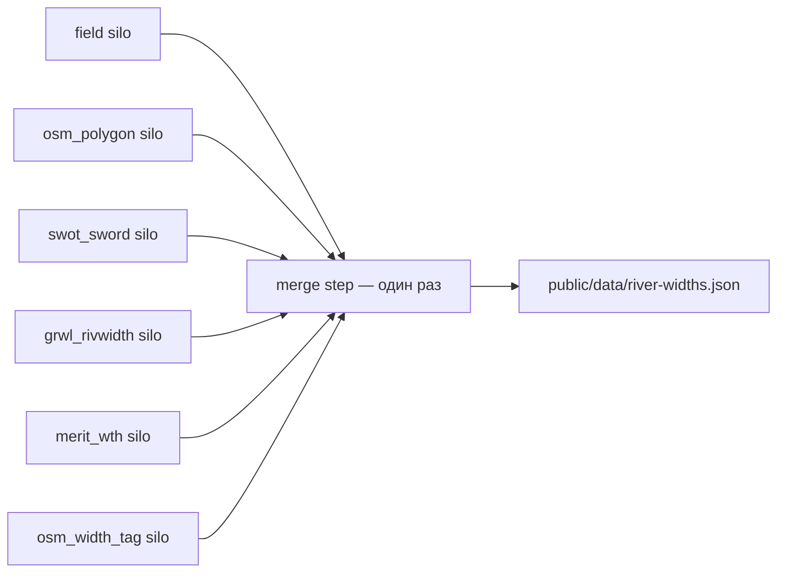

# Протокол злиття: ширина річки (fusion)

`checkedAt`: 2026-08-09  
Scope: операційний bbox мапи = `MAP_EXTENT` (`south` 49.85, `west` 29.2, `north` 51.28, `east` 32.3) — див. `src/lib/mapExtent.ts`.  
Мета: зібрати **незалежні** оцінки локальної ширини русла (м) по OSM-сегментах `waterway=*` і **один раз** злити їх у `public/data/river-widths.json`.

Пов’язано: [методика вимірювання](./methodology-river-width.md) (що таке ширина, класи SUP, обмеження джерел).  
**Не змішувати** з якістю води / інцидентами, гідропостами, `classification` / local-rules, `river-hazards`.

---

## 1. Архітектура: силоси → один merge



| Роль | Хто | Пише куди | Читає |
|------|-----|-----------|--------|
| **Collector методу** | окремий агент / скрипт на **один** method id | **лише** свій файл у `docs/research/river-width/` | свої джерела + OSM/геометрію мапи за потреби; **не** чужі силоси |
| **Merge** | **один** пізніший крок (людина або скрипт merge) | **лише** `public/data/river-widths.json` | усі заповнені силоси |
| **UI / інші домени** | поза цим протоколом | нічого в силосах і в fusion-файлі | готовий `river-widths.json` |

Спільна схема силосу: [`docs/research/river-width/_schema.md`](./research/river-width/_schema.md).

---

## 2. Анти-петля (hard rules)

1. **Колектори методів НІКОЛИ не спілкуються** між собою: немає ping-pong чатів, немає «перевір за мною SWOT», немає спільного scratch-файлу між методами.
2. Колектор **НІКОЛИ не призначає follow-up** іншому методу й **НІКОЛИ не чекає** на sibling-вихід.
3. Кожен метод пише **ONLY** у свій silo-файл (таблиця §3). Один метод = один шлях.
4. **ONLY** крок merge може писати `public/data/river-widths.json`. Collectors **не** чіпають цей файл (навіть «тимчасово»).
5. **Один write на silo**: collector заповнює свій файл **один раз** за прогін і зупиняється. Немає циклів «доробити після merge».
6. **Merge один раз** за прогін: прочитав силоси → вибрав переможця по пріоритету → записав артефакт → кінець. Повторний merge — лише новий явний прогін (нова дата / нова версія знімка), не нескінченне «підкрутити».
7. Якщо silo порожній або метод не зміг зібрати дані — merge **пропускає** цей method id; не створює фейкові `widthM`.

---

## 3. Силосні шляхи (method id → файл)

| priority | `method` id | Файл silo | Що збирає |
|---------:|-------------|-----------|-----------|
| 1 | `field` | `docs/research/river-width/field.json` | Польові / клубні оцінки + точкові Sentinel-2 (10 м) маски / spot checks; локально, sparse |
| 2 | `osm_polygon` | `docs/research/river-width/osm_polygon.json` | Ортогональна ширина від полігонів `natural=water` + `water=river\|canal` уздовж осі OSM |
| 3 | `swot_sword` | `docs/research/river-width/swot_sword.json` | SWOT L2 River / SWORD reach/node виміри (просторова прив’язка до OSM) |
| 4 | `grwl_rivwidth` | `docs/research/river-width/grwl_rivwidth.json` | GRWL / RivWidth; надійно переважно для русел ≳30 м |
| 5 | `merit_wth` | `docs/research/river-width/merit_wth.json` | MERIT Hydro `wth` — грубий prior, зокрема малі streams |
| 6 | `osm_width_tag` | `docs/research/river-width/osm_width_tag.json` | Тег OSM `width=*` на `waterway` — weak prior |

Усі шляхи відносно кореня репо. Імена файлів = `method` id + `.json` (окрім `_schema.md`).

---

## 4. Пріоритет довіри (credibility) для `widthM`

Коли кілька методів покривають **той самий** OSM-сегмент (ключ `osmId`):

| Rank | `method` | Коли вважати валідним переможцем |
|-----:|----------|----------------------------------|
| 1 (найвищий) | `field` | Є локальне число / ортогональ зі Sentinel-2 spot check або підтверджена польова оцінка в метрах |
| 2 | `osm_polygon` | Полігон покриває достатню частку сегмента; ≥1 валідна ортогональ (краще медіана з `nSamples`) |
| 3 | `swot_sword` | Join reach/node до сегмента в межах порога відстані; `widthM` валідне |
| 4 | `grwl_rivwidth` | Join OK; пам’ятати слабкість для вузьких (&lt;~30 м) — тоді `confidence` знижувати |
| 5 | `merit_wth` | Raster prior; лише якщо вищі відсутні |
| 6 (найнижчий) | `osm_width_tag` | Є розпарсений `width=*`; лише якщо вищі відсутні |

**Правила вибору:**

1. Взяти **найвищий rank**, для якого є валідний запис по `osmId` (або sample, що join’иться до цього `osmId`).
2. Якщо вищого немає → використати нижчий і виставити `confidence` відповідно (нижчий prior → зазвичай `low` / `medium`, ніколи видавати слабий prior як `high`).
3. **Ніколи** не усреднювати несумісні методи «наосліп» (не `(A+C)/2` без явної політики).
4. Переможець → поля верхнього рівня (`widthM`, `method`, `confidence`, …). Решта валідних оцінок того ж сегмента → масив `alternates[]` (див. схему цільового файлу / silo).
5. Якщо жоден метод не дав числа → сегмент **не** потрапляє в `byOsmId` **або** потрапляє з `widthM: null`, `method: "unknown"`, `confidence: "none"` — на розсуд merge; порожній каталог краще за вигадану ширину з буфера лінії (антипатерн з базової методики).

### Орієнтири `confidence` після вибору переможця

| Умова | `confidence` |
|-------|----------------|
| `field` з чітким локальним виміром / кількома sentinel ортогоналями | `high` або `medium` |
| `osm_polygon`, ≥5 ортогоналей, стійкий розкид (напр. P90/P10 &lt; 3) | `high` |
| `osm_polygon` рідкий / часткове покриття; або `swot_sword` / `grwl_rivwidth` | `medium` (GRWL на &lt;~30 м → `low`) |
| `merit_wth` або `osm_width_tag` | `low` |
| суперечність переможця vs alternate &gt; ~40% відносної різниці | залишити переможця за rank; `confidence` не вище `medium`; обов’язково зберегти alternate |

---

## 5. Цільовий артефакт `public/data/river-widths.json`

Порожній stub уже є (`schemaVersion: 1`). Форма:

```json
{
  "schemaVersion": 1,
  "updatedAt": "ISO",
  "fetchedAt": null,
  "bbox": { "south": 49.85, "west": 29.2, "north": 51.28, "east": 32.3 },
  "sources": [ /* 6 методів з priority */ ],
  "byOsmId": {
    "<osmId>": {
      "widthM": 12.4,
      "widthClass": "medium",
      "method": "osm_polygon",
      "confidence": "high",
      "nSamples": 8,
      "checkedAt": "ISO",
      "sourceNoteUk": "опційно",
      "alternates": [
        { "method": "grwl_rivwidth", "widthM": 18.0, "confidence": "medium" }
      ]
    }
  },
  "samples": []
}
```

| Поле | Зміст |
|------|--------|
| `bbox` | Копія `MAP_EXTENT`; точки/сегменти поза bbox не merge’ити, якщо research явно не вимагає |
| `sources[]` | Реєстр 6 методів: `id` (= method), `priority`, `nameUk`, `role`, `noteUk` |
| `byOsmId` | Основний індекс для popup сегмента (як `classification.json` по `osmId`) |
| `samples[]` | Опційні точкові виміри (lat/lng) без жорсткого `osmId` або з `osmId` + зв’язком; merge може join’ити до nearest сегмента |
| `fetchedAt` | `null` до першого реального live/CI прогону; кураторський merge snapshot ≠ live poll |
| `widthClass` | Орієнтир SUP (уточнюється): `narrow` / `medium` / `wide` / `unknown` — див. базову методику |

Ключ `osmId` — рядок id OSM way (той самий, що в `water-shapes.geojson` / `WaterShapeProperties.osmId`).

---

## 6. Правила merge (чеклист)

1. Переконатися, що силоси, які існують, відповідають `_schema.md` (`schemaVersion`, свій `method`).
2. Зібрати union усіх `osmId` (і sample ids) з силосів усередині `bbox`.
3. Для кожного `osmId`: відфільтрувати валідні виміри → сортувати за `priority` зростаючим (1 найкращий) → взяти перший як winner → решту в `alternates[]` (без дублікатів method).
4. Не читати й не писати чужі домени (water-quality, hydro, hazards).
5. Оновити `updatedAt` (ISO); `fetchedAt` лишати `null`, якщо це не live scrape.
6. Записати **один** файл `public/data/river-widths.json` і зупинитися.
7. Не запускати collectors повторно «щоб підчистити» після merge в тому ж прогоні.

---

## 7. Що робить (і чого не робить) collector методу

**Робить:**

- Читає відкриті дані свого джерела в межах `MAP_EXTENT`.
- Пише / перезаписує **лише** свій silo JSON за спільною схемою.
- Ставить `method` рівним своєму id; `priority` можна дублювати для зручності merge, але джерело істини — таблиця §4.
- Завершує роботу після одного успішного write (або чесного порожнього silo з `features: []` / `byOsmId: {}`).

**Не робить:**

- Не читає інші `docs/research/river-width/*.json` (крім `_schema.md`).
- Не пише в `public/data/river-widths.json`.
- Не змінює `docs/methodology-river-width.md` / fusion-док «під себе».
- Не імплементує UI мапи.
- Не чіпає water-quality / hydro.

---

## 8. Live пізніше (нотатки)

| Елемент | Зараз | Пізніше |
|---------|--------|---------|
| Силоси | Порожні / разові research writes | CI job на method або ручний прогін агента |
| `river-widths.json` | Stub: порожні `byOsmId` / `samples`, реєстр `sources` | Один merge job після готовності ≥1 silo |
| `fetchedAt` | `null` | ISO після automated pipeline |
| `schemaVersion` | `1` — стабільна; breaking change лише з bump | Той самий контракт для фронту |
| UI tooltip («ширина ≈ N м») | **Відкладено** — не частина цього протоколу | Читає лише злитий JSON |
| Оновлення силосів | Один write / method / прогін | Новий прогін = нові timestamps; старий silo можна архівувати окремо, не в `public/` |

Рекомендований порядок першого живого прогону (немає залежностей між кроками 1–6):

1. Паралельно або в будь-якому порядку: collectors `field` … `osm_width_tag` (кожен сам по собі).
2. Коли збір зупинено — **один** merge.
3. Лише потім (інша фаза) — UI.

---

## 9. Файли

| Шлях | Призначення |
|------|-------------|
| `docs/methodology-river-width.md` | Наука вимірювання / джерела |
| `docs/methodology-river-width-fusion.md` | **Цей** протокол взаємодії й злиття |
| `docs/research/river-width/_schema.md` | Спільна схема silo |
| `docs/research/river-width/<method>.json` | Вихід одного методу |
| `public/data/river-widths.json` | Злитий артефакт для продукту |
| `src/lib/mapExtent.ts` | `MAP_EXTENT` / bbox |
| `public/data/water-shapes.geojson` | Осьові / водні фічі OSM (`osmId`) — join target |

---

## 10. Коротке резюме пріоритетів

1. `field` (Sentinel-2 / поле)  
2. `osm_polygon`  
3. `swot_sword`  
4. `grwl_rivwidth`  
5. `merit_wth`  
6. `osm_width_tag`  

Переможець за rank + `alternates[]`; без тихого усереднення; один silo write; один merge.
