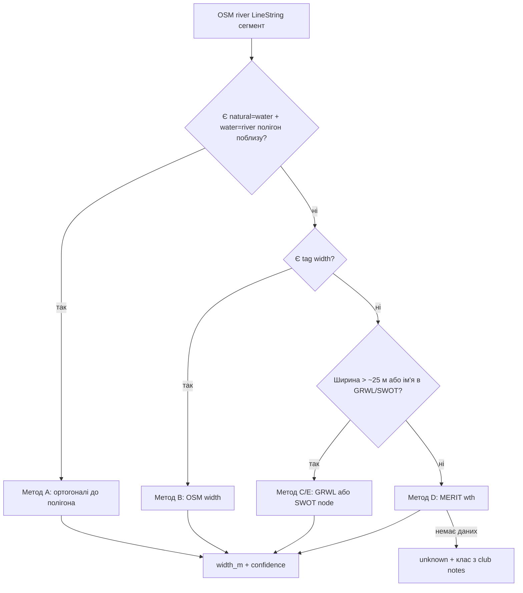

# Методика: ширина сегмента річки

`checkedAt`: 2026-08-09  
Scope: Київська область, сегменти `waterway=*` у мапі SUP / плавання.  
Мета: оцінити **локальну ширину** русла (м), щоб допомагати з прохідністю SUP (вузько / нормально / широко), **окремо** від кольору заборон.

Графічні ролі (точка / пляма / вісь річки) і режими мапи: [methodology-waterbody-display.md](./methodology-waterbody-display.md). River-area полігони, якщо з’являться, — окремий шар у **детально**, не замість осі й не для юридичного кольору.

---

## 1. Що вимірюємо

| Поняття | Визначення для мапи |
|---------|---------------------|
| **Сегмент** | Один OSM way `waterway=river/stream/canal` (або частина між вузлами ~200–500 м) |
| **Ширина** | Відстань між берегами впоперек течії на **типовому** рівні води (не паводок і не обмілина) |
| **Одиниця** | метри; для UI — класи: `<5`, `5–15`, `15–40`, `>40` м (пороги уточнюються під SUP) |

Не вимірюємо «ширину заплави» й не змішуємо з озерами/водосховищами.

---

## 2. Варіанти джерел (порівняння)

### A. Гіпотеза: контур OSM (`natural=water` + `water=river`)

**Ідея:** полігон дзеркала води ≈ обрис русла; ортогональ до осьової лінії дає ширину.

**Як рахувати (алгоритм RivWidth-подібний):**
1. Взяти осьову `waterway=river` (або скелет полігона).
2. На кроці 50–100 м уздовж осі — провести перпендикуляр.
3. Перетнути перпендикуляр із полігоном води → відстань між точками = `width_m`.
4. Для сегмента зберегти `widthP50` (медіана), `widthP10/P90`, `nSamples`, `method: osm_polygon`.

**Плюси:** безкоштовно, локально, узгоджено з уже нашою геометрією OSM.  
**Мінуси (важливо для Київщини):**
- У `water-shapes.geojson` річки зараз переважно **лінії**, не полігони. Покриття `water=river` нерівномірне (ширші ділянки / Дніпро краще, малі притоки часто лише лінія).
- Тег `width=*` на ways у OSM рідко заповнений і суб’єктивний.
- Зимові / зарослі береги та старі edits можуть відставати від реальності.
- Береги = «картографічна умовність», не вимірювання.

**Висновок:** для **нашої** мапи це правильний **перший локальний метод**, але лише там, де є river-area полігони; інакше confidence = `none` / fallback.

### B. Тег OSM `width=*` на лінії

**Ідея:** якщо mapper вказав `width=12`.  
**Плюси:** нульова вартість.  
**Мінуси:** покриття дуже рідке; не оновлюється.  
**Роль:** weak prior / валідація методу A.

### C. GRWL / RivWidth / RivWidthCloud (супутник Landsat ~30 м)

**Ідея:** готові глобальні width вздовж центроліній (Allen & Pavelsky; RivWidthCloud на GEE).  
**Плюси:** незалежна від OSM фізична оцінка «мокрої» ширини.  
**Мінуси:**
- надійно для річок **≳30 м**; Ірпінь/малі притоки часто нижче порога;
- сезон знімка ≠ «типовий» рівень для SUP;
- потрібен join GRWL ↔ OSM (просторова прив’язка).

**Роль:** для **Десни**, **Дніпра**, широких плес — калібрування / заміщення там, де полігонів мало.

### D. MERIT Hydro `wth` (~90 м raster)

**Ідея:** raster ширини русла з гідрографії MERIT.  
**Плюси:** глобально, є малі потоки краще за GRWL.  
**Мінуси:** груба сітка; модельна величина, не спостереження SUP-сезону.  
**Роль:** грубий prior для безіменних streams.

### E. SWOT L2 River / SWORD (сучасний радар, 2023+)

**Ідея:** ширина по reaches (~10 км) і nodes (~200 м); є продукти з фокусом і на Україну.  
**Плюси:** актуальні прольоти, незалежні від OSM.  
**Мінуси:** мінімальна ширина / маска HR не покриває дуже вузькі канали; reaches довші за наш OSM-сегмент.  
**Роль:** фаза 2 для великих річок; валідація A/C.

### F. Супутникові маски високої роздільності (Sentinel-2 10 м, Planet…)

**Ідея:** водяна маска → ортогоналі як у RivWidth.  
**Плюси:** краща роздільність за Landsat для 10–30 м річок.  
**Мінуси:** хмари, зарості, потрібен пайплайн (GEE / локальний).  
**Роль:** точкове покращення для curated маршрутів (Ірпінь, Козинка).

### G. Польові / клубні оцінки + панорами

**Ідея:** «вузьке русло», «ледь проходиш» у звітах; Street View / фото на мостах.  
**Плюси:** релевантно для SUP.  
**Мінуси:** якісно, не в метрах.  
**Роль:** labels / confidence boost, не числова основа.

---

## 3. Рекомендована методика для kyiv-paddle-map (гібрид)



### Пріоритет джерел (від сильнішого)

1. **A — OSM river polygon orthogonals** (якщо полігон покриває ≥70% довжини сегмента)
2. **C/E — GRWL або SWOT** (якщо distance-join < 150 м і `width_m` валідне)
3. **B — OSM `width=*`** (лише як prior з `confidence: low`)
4. **D — MERIT Hydro wth** (грубий prior, `confidence: low`)
5. Інакше `unknown`

### Правила якості

| Умова | `confidence` |
|-------|----------------|
| A, ≥5 ортогоналей, P90/P10 < 3 | `high` |
| A з рідкими полігонами / C з Landsat | `medium` |
| B або D | `low` |
| суперечність A vs C > 40% | `medium` + зберегти обидва значення в `sources` |

### Збереження в даних (пропозиція)

```ts
riverWidth: {
  widthM: number | null          // медіана
  widthClass: 'narrow'|'medium'|'wide'|'unknown'
  // narrow <8м, medium 8–25, wide >25 (чернетка під SUP)
  method: 'osm_polygon'|'osm_tag'|'grwl'|'swot'|'merit'|'unknown'
  confidence: 'high'|'medium'|'low'
  samples?: number
  checkedAt: string
  sources: string[]
}
```

Артефакт: `public/data/river-widths.json` keyed by `osmId` (як `classification.json`).  
UI: tooltip / popup сегмента («ширина ≈ 12 м · OSM-контур»), **не** перефарбовує статус заборон.

---

## 4. Імплементація по фазах

### Фаза 1 (швидко, лише OSM) — підтверджує гіпотезу
1. Розширити `fetch-shapes`: окремо збирати `natural=water`+`water=river|canal` у bbox Київщини.
2. Скрипт `scripts/measure-river-width.mjs`:
   - join полігонів до LineString (перетин буфера 30–50 м);
   - ортогоналі + медіана;
   - записати `river-widths.json`.
3. Показати в popup лише якщо `widthM != null`.

### Фаза 2 — валідація
1. Точково: 10–20 сегментів Десни / Ірпеня / Тетерева / Росі порівняти з GRWL або SWOT nodes.
2. Зафіксувати bias OSM vs супутник (часто OSM вужчий/ширший).

### Фаза 3 — прогалини
1. MERIT fallback для streams без полігона.
2. Для curated paddle rivers без числа — якісний клас з club reports.

---

## 5. Обмеження (честно)

- Ширина **сезонна**; для SUP важливіший «найгірший типовий літній рівень», а не один знімок.
- На завалах/острівцях ортогональ вимірює неправильний рукав — різати за `nchannels` / острівками.
- Метрика **не замінює** юридичний статус і не означає «можна плавати».

---

## 6. Джерела

- OSM Wiki: [Waterways](https://wiki.openstreetmap.org/wiki/Waterways), [`width=*`](https://wiki.openstreetmap.org/wiki/Key:width), river area `natural=water`+`water=river`
- Pavelsky & Smith — RivWidth (IEEE GRSL 2008)
- Yang et al. — RivWidthCloud (IEEE GRSL 2019)
- Allen & Pavelsky — GRWL / Global Extent of Rivers and Streams (Science 2018)
- MERIT Hydro — шар `wth` (Yamazaki et al.)
- SWOT L2 River / SWORD; є колекції river reaches для України (UNESCO IHP-WINS / PO.DAAC)

---

## 7. Рішення для продукту (коротко)

**Так, гіпотеза з OSM-контуром — правильна база**, але:
1. потрібні **окремі river-area полігони**, не лише лінії з `water-shapes`;
2. для широких вод додаємо **GRWL/SWOT** як перевірку;
3. для вузьких без полігона — `unknown` або слабкий MERIT prior, а не вигадана ширина з буфера лінії (буфер `width=default` без вимірювання — заборонений антипатерн).
