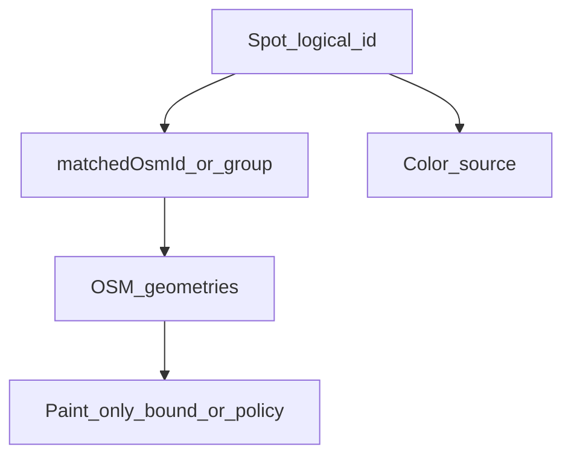

# Методика: графічний показ водойм

`checkedAt`: 2026-08-09  
Scope: Київ + Київська область (`MAP_EXTENT`, північ **51.28**).  
Мета: канонічні правила **як малювати** водойми (точка / пляма / лінія), як зберігати **логічну цілісність** Spot ↔ геометрія ↔ колір, і як це змінюється в режимах `restrictions` | `paddle` | `detail`.

Код лишається джерелом runtime-поведінки (`PaddleMap.tsx`, `geo.ts`, `App.tsx`). Цей документ зводить уже прийняті рішення й закриває прогалини в цілісності відображення.

Пов’язано: [whole-river-coloring-audit](./research/whole-river-coloring-audit.md), [methodology-river-width](./methodology-river-width.md), [methodology-water-quality-incidents](./methodology-water-quality-incidents.md), [methodology-hydro-posts](./methodology-hydro-posts.md).

---

## 1. Цілі й non-goals

**Цілі**
- Одна логічна водойма для користувача = один `Spot` (curated або derived), а не випадкова суміш маркера, чужої лінії й сірої плями підкладки.
- Чіткі ролі геометрії: **якір** / **контур** / **вісь**.
- Режими мапи змінюють **фільтр + палітру + щільність**, не геометричний клас (озеро не стає лінією).

**Non-goals**
- Не кадастр усіх OSM-калюж і безіменних ровів.
- Не перефарбовувати юридичний/paddle stroke від WQ, інцидентів, гідропостів чи hazards.
- Не «зшивати» всю річку одним кольором за назвою (див. audit).

---

## 2. Locked decisions (не переглядаємо)

| Рішення | Де живе |
|---------|---------|
| Річки = `LineString` (`kind: river`); озера/ставки/вдсх/кар’єри = `Polygon` / `MultiPolygon` | `water-shapes.geojson`, `fetch-shapes.mjs` |
| Юридичний колір річки — **per OSM `osmId`**, ніколи «вся назва» з одного спота/токена | `resolveRiverLevel`, `local-rules.json` (`byRiverNameToken` порожній; громади — `bbox`) |
| Заборони ≠ paddle ≠ деталь (`mapMode`) | `App.tsx`, `FilterPanel.tsx` |
| Детально: суцільний синій `#0f5a94`; річки лише з `widthM > 1`; без градієнта ширини | `DETAIL_RIVER_*`, `hasDisplayableWidth`, `widthShapeStyle` |
| Північ карти = **51.28** | `mapExtent.ts` |
| Default `showAllShapes: false` — озера точками; повні контури — чекбокс | `App.tsx`, FilterPanel «Показати повні контури водойм» |
| Продуктовий фокус: curated + іменовані шари, не анонімна сітка як «покриття» | research / spots pipeline |

---

## 3. Модель: Spot ↔ geometry group ↔ paint unit

| Поняття | Одиниця | Приклад |
|---------|---------|---------|
| **Логічна водойма** | `Spot.id` | `redkyne`, `blakytne`, `derived-…` |
| **Bind / group** | один або кілька `osmId` | озеро → poly; каскад → `matchedOsmIds[]` (ціль) |
| **Paint unit (річка)** | сегмент `classification.features[osmId]` | hromada A червона, далі зеленая на тій самій назві |
| **Paint unit (озеро)** | poly групи спота | не «перший way у радіусі» |

**Джерела кольору за режимом**
- `restrictions` — `restriction.level` / classification сегмента
- `paddle` — `paddleVerdict` (і лише на дозволених restriction-рівнях)
- `detail` — суцільний синій (не статус заборони)

---

## 4. Три ролі геометрії

Розділяємо логічну водойму і **графічну роль** OSM-фічі.

| Роль | Геометрія | Коли |
|------|-----------|------|
| **Якір (точка)** | `CircleMarker` у точці **всередині** matched Polygon (не vertex-mean, який часто на суші) | Стоячі водойми, компактний режим; вибір зі списку; низький zoom |
| **Контур (пляма)** | `Polygon` / `MultiPolygon` fill | Ті самі стоячі водойми при `showAllShapes` **і** bind до спота / derived |
| **Вісь (лінія)** | `LineString` `kind: river` | Тільки річкова мережа (у fetch — і канали/stream як river) |

Mutual exclusion зараз: при `showAllShapes` малюються контури озер, без їхніх CircleMarker; при `false` — навпаки. Річкові лінії **не** залежать від цього чекбокса.

Майбутні river-area полігони (див. [methodology-river-width](./methodology-river-width.md)) — окремий шар у **детально**, не замість осі й не для юридичного кольору в restrictions.

---

## 5. Матриця: `kind` × роль

| Клас `kind` | Точка | Пляма | Лінія |
|-------------|-------|-------|-------|
| lake / pond / quarry / reservoir / basin | Так (default) | Так (контури on) | **Ні** |
| river / bay / channel | Ні | Ні* | Так |
| synthetic paddle / class | Як у батьківського класу | — | Річки — лінія |

\* Крім майбутніх river-area в detail (окремий шар).

**Правило match для стоячих:** `kind ∈ {lake, pond, reservoir, quarry, basin}` → primary geometry **лише** Polygon/MultiPolygon. LineString ніколи не є primary для озера.

Вибраний спот: підсвітка якоря **або** обведення контуру (залежно від `showAllShapes`), ніколи якір на річці + чужий poly.

---

## 6. Інваріанти цілісності

1. Маркер і контур одного спота — **одна й та сама** геометрія / group (XOR за toggle, однаковий bind). Якір стоячої водойми лежить **всередині** полігона (`interiorPointForShape`), не на суші від vertex-mean.
2. Немає фарбування незабайнденої сірої плями «ніби це вибране озеро».
3. Річкова лінія не підміняє озеро, навіть якщо близько.
4. Basemap water (Carto / OSM tiles) **не є** шаром продукту: сірі плями підкладки ≠ наші контури.
5. Unmatched polys не показуються як «основний» paint обраного спота; політика completeness — derived + імена, не сірі сироти як підміна спота.
6. Режим не змінює геометричний клас — лише видимість, палітру й щільність сітки.

### Радіуси bind (поточні в коді)

| Шлях | Обмеження |
|------|-----------|
| `matchSpotToShape` озеро ↔ poly | ~4 km |
| `matchSpotToShape` озеро ↔ river (legacy) | ~12 km — **не повинно** вигравати для standing kinds |
| Curated river name-token | ≤ 25 km (`SPOT_NAME_BIND_KM`) |
| Non-river poly name-token (cascade) | ≤ 40 km (`POLY_NAME_BIND_KM`) |
| Empty / generic names (`NORM("Річка")` → `""`) | **Не** давати `nameHit`; інакше false positive |

---

## 7. Де дробити, де цільно

| Що | Дробити | Цільно |
|----|---------|--------|
| Юридичний колір річки | Завжди по сегменту `osmId` (hromada bbox) | Ніколи всю назву |
| Список / paddle verdict | Можна групувати по name token для UX | Один list-item ≠ один stroke |
| Каскад озер (Пуща, Редькине / Горащиха…) | Не на випадкові маркери | Один curated Spot → group кількох poly; якір у центроїді групи; усі контури групи при contours on |
| MultiPolygon relation | Кілька кілець у Leaflet OK | Один bind, один статус |
| Анонімна річкова сітка | Zoom ≥ `FULL_RIVER_ZOOM_MIN` (10) | Не зводити в один «водотік області» |
| Каскад Дніпра / вдсх | — | Відповідні OSM features → `banned_navigation` (у т.ч. MultiPolygon relations у detail+contours) |

---

## 8. Покриття без пропусків (реалістичне)

Пріоритет зверху вниз:

1. **Curated `spots.json`** — повний bind до poly (озера) / релевантних сегментів (річки).
2. **Derived** з іменованих non-river shapes (`deriveSpotsFromShapes`).
3. **River-class / paddle synthetics** з classification / club reports.
4. **Контекстна сітка:** небайндені річкові лінії в `restrictions` при zoom ≥ 10; небайндені polys — лише приглушений «довідковий» стиль **або** hidden (не як обраний спот).
5. **Не ціль:** повний mesh кожного безіменного рову.

У UI: лічильник FilterPanel = visible vs total **у поточному режимі**; карта не є кадастром усіх калюж OSM.

---

## 9. Режими × фрагментація

| | restrictions | paddle | detail |
|--|--------------|--------|--------|
| **Озера default** | Точка кольором restriction | Точка кольором verdict (якщо є) | Точка / контур синій |
| **Озера contours** | Пляма кольором спота; unmatched — приглушено або вимк | Лише polys зі спотом + verdict | Лише не-banned; solid blue |
| **Річки** | Сегменти classification; unbound mesh zoom ≥ 10 | Лише сегменти/токени з verdict; без `banned_navigation` | Лінії `widthM > 1`, solid blue; без red cascade |
| **Фрагментація** | Макс. (сегмент = колір) | Середня (мережа обрізана вердиктами) | Середня (width-gate) + overlays окремо |
| **Overlays** | Вимк | Вимк | hazards / hydro / WQ / incidents |

---

## 10. Антипатерн: Редькине / Пуща-Водиця (regression)

**Симптом:** у списку «Озера Редькине / Пуща-Водиця»; на карті — синя точка + тонка синя лінія («Річка» / Котурка) + сіра пляма води (часто Carto basemap або unbound poly), без однозначного контуру потрібного озера.

**Кореневі причини (зафіксовані)**
1. `matchSpotToShape`: `NORM("Річка")` → порожній рядок; `hint.includes("")` дає хибний `nameHit` → bind стоячого спота на короткій LineString.
2. Snap lat/lng спота до centroid цієї лінії → маркер «їде» з озера.
3. Справжні polys каскаду (напр. Горащиха `relation/1679854`) лишаються unbound; далеке «Редькине (Міністерське)» може ловитись token-pass на більшій відстані.
4. Користувач читає **basemap water** як шар продукту.

**Очікувана поведінка після виправлень**
- `redkyne` / `blakytne` (і подібні) → primary bind лише на Polygon/MultiPolygon каскаду (явні `matchedOsmId` / group), не на generic «Річка».
- У default: одна кольорова точка на центроїді групи.
- При contours on: залиті polys групи тим самим статусом/кольором режиму; без окремої «чужої» river-осі як сурогату озера.
- Carto water лишається фоном і не інтерпретується як наш контур.

**Регресійний чеклист**
- [ ] Standing spot ніколи не має `matchedOsmId` на `LineString`.
- [ ] Empty-name / `Річка` / `Stream` не дають nameHit.
- [ ] Вибір спота в paddle/restrictions/detail не показує маркер на чужій осі + сіру сироту як «тіло» озера.
- [ ] `showAllShapes` малює polys групи, не випадковий poly за схожою назвою за 10+ km без bbox.

---

## 11. Наслідки для майбутнього коду (поза цим документом)

Імплементація окремим кроком, не змішуючи з логікою режимів:

1. Fix `matchSpotToShape`: no empty-string nameHit; standing kinds → poly-only primary.
2. Явні `matchedOsmId` / `matchedOsmIds[]` для каскадів Пуща / Редькине / Горащиха.
3. Політика unmatched polys: приглушити або ховати; ніколи як primary paint вибраного спота.
4. За потреби — груповий центроїд для якоря.

---

## 12. Ключові файли

| Файл | Роль |
|------|------|
| `src/components/PaddleMap.tsx` | visibleShapes, маркери vs контури, режими |
| `src/lib/geo.ts` | matchSpotToShape, widthShapeStyle, DETAIL_RIVER_BLUE |
| `src/App.tsx` | mapMode filters, default `showAllShapes: false` |
| `public/data/water-shapes.geojson` | OSM геометрії |
| `public/data/spots.json` | curated логічні водойми |
| `public/data/classification.json` | per-segment legal level |
| `public/data/local-rules.json` | громади + note про вимкнені name tokens |
