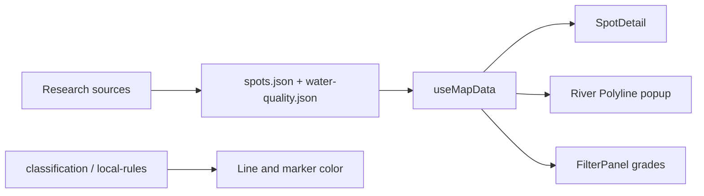

# План досліджень: прохідність SUP + чистота води

## Мета і scope

- **Обсяг:** curated spots (~30) + ~192 іменовані річки (як у `local-rules`), не вся анонімна сітка.
- **Два незалежні шари знань** (не змішувати з кольором заборон):
  1. **Прохідність** — чи фізично реально пройти на SUP.
  2. **Чистота / контакт з водою** — чи варто купатися / падати з дошки.
- **Колір лінії** лишається за **юридичним/громадівським статусом** (`restriction` / `classification`). Нові дані — окремі поля + UI, не перефарбовують жовте/зелене.

## Модель даних (спільна для всіх пунктів)

Новий артефакт `public/data/water-quality.json` + розширення spots / river meta:

```ts
paddleability: {
  grade: 1|2|3|4|5  // 1=непрохідно … 5=відмінно
  hazardsUk: string[]  // мілини, греблі, затори, УЗВ-ризик берега
  seasonHintUk: string
  sources: string[]
  checkedAt: string
  confidence: 'high'|'medium'|'low'
}
waterQuality: {
  status: 'ok'|'advisory'|'unsafe'|'unknown'
  labelUk: string
  lastSampleAt?: string
  metricsNoteUk?: string
  sources: string[]
  checkedAt: string
}
```

- Spots: поля в `public/data/spots.json` (замінити/змапити грубі `paddleSuitability` / `swimSuitability`).
- Іменовані річки: `byRiverNameToken` у `water-quality.json`; лоадер підтягує в popup лінії.
- Типи: `src/types.ts`; лоад: `src/hooks/useMapData.ts`.



---

## Пункти досліджень і інкорпорація в карту

### 1. Звіти каяк-/SUP-клубів (прохідність)

**Дослідження:** 1–3 джерела на іменовану річку / spot (звіти сплавів 2020–2026): мілини, греблі, затори, витрата води, сезон.

**У карту:**
- `paddleability.grade`, `hazardsUk[]`, `seasonHintUk`, `sources`, `confidence`.
- `SpotDetail.tsx`: блок «Прохідність SUP».
- Popup річки в `PaddleMap.tsx`: grade + 1 hazard.
- Опційно: filter «мін. прохідність» у `FilterPanel.tsx`.

### 2. OpenStreetMap (структура русла)

**Дослідження:** агрегація з `water-shapes.geojson`: `dam` / `weir` / `tunnel` / `intermittent` (скрипт `scripts/derive-paddle-hints.mjs`).

**У карту:**
- Auto-hints → `paddleability.hazardsUk` («OSM: …»), `confidence: low` без польових звітів.
- OSM лише коригує вниз; не ставить високий grade сам.
- Zoom ≥12: маркери перешкод (окремий шар).

### 3. Гідрологія / рівні води

**Дослідження:** прив’язати Десну, Тетерів, Рось, Ірпінь, Стугну, Трубіж, Здвиж до постів Укргідрометцентру; URL + пороги низько/норма/високо.

**У карту:**
- `hydro: { stationId, url, noteUk }`.
- SpotDetail: deep-link «Рівень води» (live scrape — фаза 2).
- Не впливає на колір статусу.

### 4. Супутник / сезонні знімки

**Дослідження:** разовий огляд ключових сегментів (ширина, зарості, пересихання).

**У карту:**
- Внесок у `paddleability.grade` / `hazardsUk` з `confidence: medium`.
- Без шару супутника в UI.

### 5. Локальні групи / польові розвідки

**Дослідження:** черга spots без клубних звітів → checklist входу (ширина, течія, сміття, спуск).

**У карту:**
- Оновлення `paddleability`, `confidence: high`.
- Badge: «Перевірено в полі · {date}».

### 6. Юридична «прохідність» (вже є)

**Дослідження:** підтримка `local-rules.json` + scrape-bans.

**У карту:**
- Колір без змін; у SpotDetail явно три блоки: **Статус** | **Фізична прохідність** | **Чистота**.

### 7. Офіційні проби на купання (чистота)

**Методика (схема + плейсхолдери):** [`docs/methodology-water-quality-incidents.md`](./methodology-water-quality-incidents.md) — каталог `sampleSites` vs `observations`, окремо `water-incidents.json`, live-ready JSON у `public/data/`.

**Дослідження:** КП «Плесо», Держпродспоживслужба, лабцентри — списки «можна / не можна» (хуки в реєстрі `sources[]`; деталі → `docs/research/*`).

**У карту:**
- `waterQuality.status` + `sampledAt` + sources (завантаження вже в `useMapData`; UI шар відкладено).
- Бейдж у SpotDetail; опційний фільтр «лише ok».
- `scripts/scrape-water-quality.mjs` → `fetchedAt` / `sampledAt`.

### 8. МОЗ / зведення «пляж не відповідає»

**Дослідження:** публікації з іменними пляжами/містами.

**У карту:**
- Мапити в `observations` відповідних `sampleSites` / spots.
- Якщо лише пляж, не вся річка — `advisory` + note «стосується пляжу X».

### 9. Спеціальні епізоди (Десна / Сейм тощо)

**Дослідження:** `incidents[]` у `public/data/water-incidents.json` (не змішувати з каталогом проб).

**У карту:**
- Активний інцидент → `unsafe` + банер у деталях.
- Після закриття → `unknown`/`advisory` до нової проби.

### 10. Громадський / НГО моніторинг

**Дослідження:** разові проби з URL і датою.

**У карту:**
- У `sources`, `confidence: low`; не перебивають офіційні проби.

### 11. Польові індикатори (запах, піна, скиди)

**Дослідження:** checklist при розвідці (п.5).

**У карту:**
- Теги в `hazardsUk` / tips.
- Не ставити `unsafe` без джерела (крім інциденту).

---

## Порядок робіт (фази)

1. **Схема + UI-заглушки** — типи, `unknown`, розділені блоки SpotDetail, лоад `water-quality.json`.
2. **Прохідність spots** — клубні звіти; OSM-hints для named rivers.
3. **Чистота spots** — Плесо/лабцентр; епізоди Десни.
4. **Named rivers** — топ-30 → `byRiverNameToken`.
5. **Фільтри + deep-link гідропостів**.
6. **Автооновлення** — `scrape-water-quality` + дата в UI.

## Критерії готовності

- У деталях кожного curated spot: статус / прохідність / чистота з джерелами.
- Popup іменованої річки: grade прохідності (або «невідомо») + чистота якщо є.
- Колір лінії = лише local-rules / cascade.
- Методи описані в `rules.json` (`paddleabilityMethod`, `waterQualityMethod`).

## Todos

- [ ] Типи + water-quality.json + розділені блоки Status/Passability/Quality у SpotDetail
- [ ] Дослідження клубних звітів → paddleability для всіх curated spots
- [ ] scripts/derive-paddle-hints.mjs (dam/weir/intermittent) → hazards для named rivers
- [ ] Плесо/лабцентри/епізоди → waterQuality для spots + scrape-water-quality
- [ ] byRiverNameToken для топ іменованих річок + popup на лінії
- [ ] Фільтри grade/quality + deep-link гідропостів; методи в rules.json
